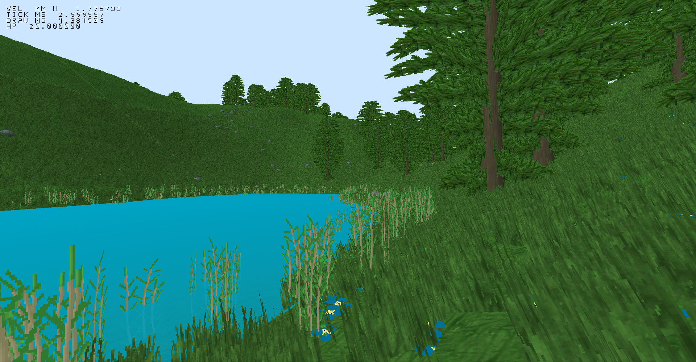

# 3D test game
This is a simple game made in C++ with OpenGL.

The purpose of this project is to implement:

- Physics made with Verlet integration
- Terrain generation with bicubic interpolated white noise
- Animations
- Collision detection (cylinders, non-axis-aligned cubes, planes)

